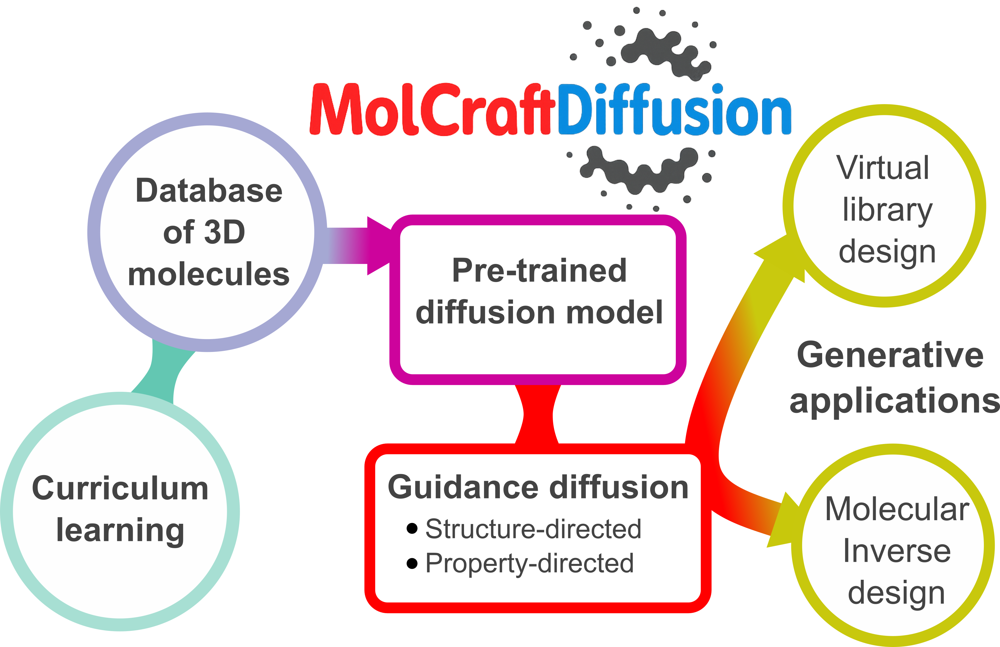

MolecularDiffusion
==================

The unified generative‑AI framework that streamline training the 3D molecular diffusion models to their deployment in data-driven computational chemistry pipelines



## Key Features

*   **End-to-End 3D Molecular Generation Workflow:** Support training diffusion model, and preditive models, and utilize them for various molecular generation tasks, all within a unified framework.
*   **Curriculum learning:** Efficient way for training and fine-tuning 3D molecular diffusion models
*   **Guidance Tools:** Generate molecules with specific characteristics:
    *   **Property-Targeted Generation:** Generate molecules with a target physicochemical or electronic properties (e.g., excitation energy, dipole moment)
    *   **Inpainting:** Systematically explore structural variants around reference molecules
    *   **Outpainting:** Extend a molecule by generating new parts.
*   **Command-Line Interface:** A user-friendly CLI for training, generation, and prediction.


[](https://chemrxiv.org/engage/chemrxiv/article-details/6909e50fef936fb4a23df237)
[](https://github.com/pregHosh/MolCraftDiffusion)
[](https://huggingface.co/pregH/MolecularDiffusion)
[](https://huggingface.co/pregH/MolecularDiffusion)


Installation
-----------

### Detailed Installation Guide

For a more detailed installation, including setting up a conda environment and installing necessary packages, follow these steps:

    # create new python environment
    conda create -n moleculardiffusion python=3.11 -c defaults
    conda activate moleculardiffusion

    # install pytorch according to instructions (use CUDA version for your system)
    # https://pytorch.org/get-started/
    pip install torch==2.4.0 torchvision==0.19.0 torchaudio==2.4.0 --index-url https://download.pytorch.org/whl/cu124
    
    # install pytorch geometric (use CUDA version for your system)
    # https://pytorch-geometric.readthedocs.io/
    pip install torch_geometric

    # Optional dependencies:
    pip install pyg_lib torch_scatter torch_sparse torch_cluster torch_spline_conv -f https://data.pyg.org/whl/torch-2.4.0+cu124.html
    conda install conda-forge::openbabel
    conda install xtb==6.7.1
    # install other libraries
    pip install fire seaborn decorator numpy==1.26.4 scipy rdkit-pypi posebusters==0.5.1 networkx matplotlib pandas scikit-learn tqdm pyyaml omegaconf ase morfeus cosymlib morfeus-ml wandb rmsd

    pip install hydra-core==1.* hydra-colorlog rootutils

    # install cell2mol
    git clone https://github.com/lcmd-epfl/cell2mol
    cd cell2mol
    python setup.py install
    cd ..
    rm -rf cell2mol

    # Install the package. Use editable mode (-e) to make the MolCraftDiff CLI tool available.
    pip install -e .


Usage
-----

### Pre-trained Models

Pre-trained diffusion models are available at [Hugging Face](https://huggingface.co/pregHosh/MolecularDiffusion) or in the `models/edm_pretrained/` directory. We suggest to start from this model for downstream application.

There are two ways to run experiments: using the `MolCraftDiff` command-line tool (recommended) or by executing the Python scripts directly.

### 1. `MolCraftDiff` CLI (Recommended)

Make sure you have installed the package in editable mode as described above, and that you run the commands from the root of the project directory.

**Commands:**
*   `train`: Run a training job.
*   `generate`: Run a molecule generation job.
*   `predict`: Run prediction with a trained model.
*   `eval_predict`: Evaluate predictions.

**Command Syntax:**

    MolCraftDiff [COMMAND] [CONFIG_NAME]

*   `[COMMAND]`: One of `train`, `generate`, `predict`, `eval_predict`.
*   `[CONFIG_NAME]`: The name of the configuration file from the `configs/` directory (e.g., `train`, `example_diffusion_config`).

**Examples:**

    # Train a model using the 'example_diffusion_config.yaml' configuration
    MolCraftDiff train example_diffusion_config

    # Generate molecules using the 'my_generation_config.yaml' configuration
    MolCraftDiff generate my_generation_config

**Getting Help:**

To see the main help message and a list of all commands:

    MolCraftDiff --help

To get help for a specific command:

    MolCraftDiff train --help

### 2. Direct Script Execution

You can also execute the scripts in the `scripts/` directory directly.

**Training:**

    python scripts/train.py tasks=[TASK]

where TASK is one of the following: `diffusion`, `guidance`, `regression`.

**Generation:**

    python scripts/generate.py interference=[INTERFERENCE]

where INTERFERENCE is one of the following: `gen_cfg`, `gen_cfggg`, `gen_conditional`, `gen`.

**Prediction:**

    python scripts/predict.py


### 3. Post-processing the Generated 3D Molecules                                                                                      
 The `scripts/applications/utils/` directory contains various utilities for post-processing generated 3D molecules, including:                                      
*   **XTB Optimization:** Optimize molecular geometries using the GFN-xTB method (`xtb_optimization.py`).                                                         
 *   **XYZ to RDKit Conversion:** Convert XYZ coordinate files to RDKit molecular objects (`xyz2mol.py`).                                                           
*   **Metric Computation:** Compute various quality and diversity metrics for generated molecules (`compute_metrics.py`).                                          
*   **RMSD Calculation:** Calculate Root Mean Square Deviation (RMSD) for structural comparison (`compute_rmsd.py`).                                               
*   **Molecular Similarity:** Assess molecular similarity using different algorithms (`compute_similarity.py`).   


Visualization
-------------

Generated 3D molecules and their properties can be visualized using the [3DMolViewer](https://github.com/pregHosh/3DMolViewer) package.

We also recommend our in-house and lightweight X11 molecular viewer [V](https://github.com/briling/v) package.


Tutorials
---------

A comprehensive set of tutorials is available in the [`tutorials/`](./tutorials/) directory, covering topics from basic model training to advanced generation techniques.


Project Structure
-----------------

```
├── .project-root
├── justfile
├── pyproject.toml
├── README.md
├── setup.py
├── configs
│   ├── generate.yaml
│   ├── predict.yaml
│   ├── train.yaml
│   ├── data
│   │   └── mol_dataset.yaml
│   ├── hydra
│   │   └── default.yaml
│   ├── interference
│   │   ├── gen_cfg.yaml
│   │   ├── gen_cfggg.yaml
│   │   ├── gen_conditional.yaml
│   │   ├── gen_gg.yaml
│   │   ├── gen_inpaint.yaml
│   │   ├── gen_outpaint.yaml
│   │   ├── gen_outpaintft.yaml
│   │   ├── gen_unconditional.yaml
│   │   └── prediction.yaml
│   ├── logger
│   │   └── default.yaml
│   ├── tasks
│   │   ├── diffusion.yaml
│   │   ├── diffusion_egt.yaml
│   │   ├── guidance.yaml
│   │   └── regression.yaml
│   └── trainer
│       ├── default.yaml
│       └── regression.yaml
├── data
│   └── template_structures
├── scripts
│   ├── generate.py
│   ├── predict.py
│   ├── train.py
│   └── gradient_guidance
│       ├── scheduler.py
│       └── sf_energy_score.py
└── src
    └── MolecularDiffusion
       ├── __init__.py
       ├── _version.py
       ├── cli.py
       ├── molcraftdiff.py
       ├── callbacks
       │   ├── __init__.py
       │   └── train_helper.py
       ├── core
       │   ├── __init__.py
       │   ├── core.py
       │   ├── engine.py
       │   ├── logger.py
       │   └── meter.py
       ├── data
       │   ├── __init__.py
       │   ├── dataloader.py
       │   ├── dataset.py
       │   └── component
       │       ├── __init__.py
       │       ├── dataset.py
       │       ├── feature.py
       │       └── pointcloud.py
       ├── modules
       │   ├── __init__.py
       │   ├── layers
       │   │   ├── __init__.py
       │   │   ├── common.py
       │   │   ├── conv.py
       │   │   └── functional.py
       │   ├── models
       │   │   ├── __init__.py
       │   │   ├── egcl.py
       │   │   ├── egt.py
       │   │   ├── en_diffusion.py
       │   │   └── noisemodel.py
       │   └── tasks
       │       ├── __init__.py
       │       ├── diffusion.py
       │       ├── metrics.py
       │       ├── regression.py
       │       └── task.py
       ├── runmodes
       │   ├── __init__.py
       │   ├── generate
       │   │   ├── __init__.py
       │   │   └── tasks_generate.py
       │   └── train
       │       ├── __init__.py
       │       ├── data.py
       │       ├── eval.py
       │       ├── logger.py
       │       ├── tasks_egcl.py
       │       ├── tasks_egt.py
       │       └── trainer.py
       └── utils
           ├── __init__.py
           ├── comm.py
           ├── diffusion_utils.py
           ├── file.py
           ├── geom_analyzer.py
           ├── geom_constant.py
           ├── geom_constraint.py
           ├── geom_metrics.py
           ├── geom_utils.py
           ├── io.py
           ├── molgraph_utils.py
           ├── plot_function.py
           ├── pretty.py
           ├── sascore.py
           ├── smilify.py
           └── torch.py
```


License
-------

This project is licensed under the MIT License.


Citation
--------

If you use MolecularDiffusion in your research, please cite the following:

[ChemRxiv: MolecularDiffusion: A Unified Generative-AI Framework for 3D Molecular Design](https://chemrxiv.org/engage/chemrxiv/article-details/6909e50fef936fb4a23df237)

<!-- ```bibtex
@article{hosh2025moleculardiffusion,
to be filled
}
``` -->